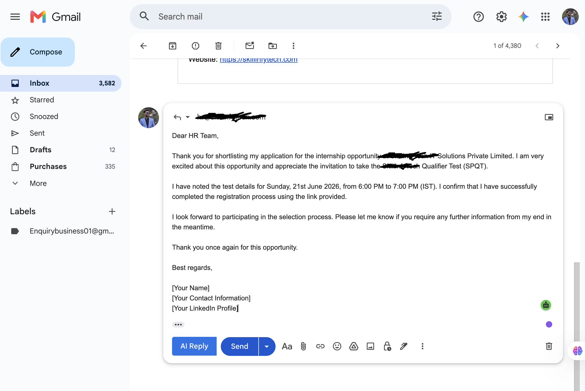

# 📧 AI Email Reply Assistant

An AI-powered Chrome Extension that generates context-aware email replies directly inside your browser. The extension helps users draft professional responses instantly, reducing time spent on repetitive email communication.

## 🚀 Preview



## ✨ Features

* 🤖 Generate AI-powered email replies
* 📩 Understand email context for relevant responses
* ⚡ Draft replies instantly within the browser
* 🌐 Seamless Chrome Extension integration
* 🔗 REST API-based architecture
* 🎨 Responsive and intuitive UI

## 🛠️ Tech Stack

### Frontend

* React.js
* JavaScript
* HTML/CSS

### Backend

* Java
* Spring Boot
* REST APIs

### AI Integration

* Gemini API

### Tools

* Git & GitHub
* Maven
* Chrome Extensions

## 🏗️ System Architecture

```text
Chrome Extension (React)
          ↓
   Spring Boot Backend
          ↓
      Gemini API
          ↓
   AI-Generated Reply
```

## 💡 Problem Statement

Replying to emails is a repetitive and time-consuming task. Whether it's work updates, follow-ups, or routine queries, drafting responses manually can reduce productivity.

This project leverages Generative AI to automate email drafting while keeping users in control of the final response.

## 🎯 Benefits

* Saves time on daily email communication
* Generates professional and context-aware replies
* Improves productivity and workflow efficiency
* Reduces email drafting time by up to **70%**

## ⚙️ Installation

### Clone the repository

```bash
git clone https://github.com/Naman-Kaushik01/email-writer.git
cd email-writer
```

### Backend Setup

1. Configure your Gemini API key:

```properties
gemini.api.key=YOUR_API_KEY
```

2. Run the Spring Boot application:

```bash
mvn spring-boot:run
```

### Frontend Setup

```bash
npm install
npm run build
```

### Load Extension in Chrome

1. Open `chrome://extensions/`
2. Enable **Developer Mode**
3. Click **Load Unpacked**
4. Select the extension build folder

## 🔮 Future Enhancements

* Email summarization
* Multi-language support
* Tone customization (Formal/Casual)
* Support for multiple email providers
* User authentication and preferences

## 🤝 Contributing

Contributions are welcome! Feel free to fork the repository and submit a pull request.

## 👨‍💻 Author

**Naman Kaushik**

* GitHub: https://github.com/Naman-Kaushik01
* LinkedIn: Add your LinkedIn profile URL here

⭐ If you found this project useful, consider giving it a star!
